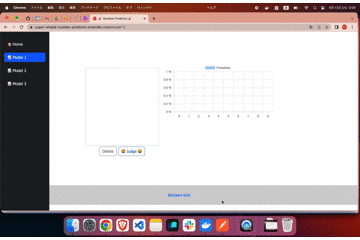

# super-simple-number-predictor

  

## 実行方法

```shell
docker build -t super-simple-number-predictor .
docker run -it --rm -p 8000:8000 --name super-simple-number-predictor super-simple-number-predictor
```
